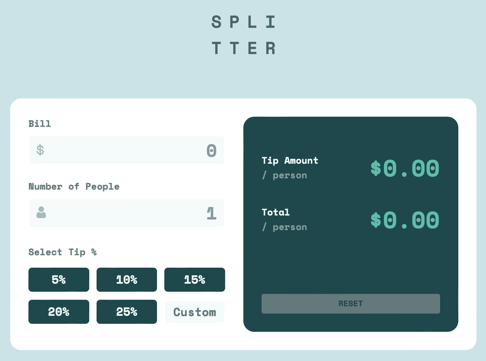

# Frontend Mentor - Tip calculator app solution

This is a solution to the [Tip calculator app challenge on Frontend Mentor](https://www.frontendmentor.io/challenges/tip-calculator-app-ugJNGbJUX). Frontend Mentor challenges help you improve your coding skills by building realistic projects.

## Table of contents

- [Overview](#overview)
  - [The challenge](#the-challenge)
  - [Screenshot](#screenshot)
  - [Links](#links)
- [My process](#my-process)
  - [Built with](#built-with)
  - [Continued development](#continued-development)
- [Author](#author)

**Note: Delete this note and update the table of contents based on what sections you keep.**

## Overview

### The challenge

Users should be able to:

- View the optimal layout for the app depending on their device's screen size
- See hover states for all interactive elements on the page
- Calculate the correct tip and total cost of the bill per person

### Screenshot

### Links

- Solution URL: https://github.com/xAnDrOm3dAx/tip-calculator 
- Live Site URL: https://xandrom3dax.github.io/tip-calculator/
- FEM solution found here: https://www.frontendmentor.io/solutions/responsive-tip-calculator-built-using-semantic-html-nested-css-and-js-KNmtrOoxbe

## My process
I have gone a little off path. I decided to rework my html to adjust the flow of the UI and have changed it so the user first inputs the bill total, selects the number of people, and then adds the tip amount. I find that it makes more sense compared than the original design. I have also made the overall design smaller, to create a compact, sharper looking UI.

### Built with

- Semantic HTML5 markup
- CSS custom properties
- Flexbox
- CSS Grid
- Vanilla JS

## Author

- Website - https://github.com/xAnDrOm3dAx
- Frontend Mentor - @xAnDrOm3dAx
